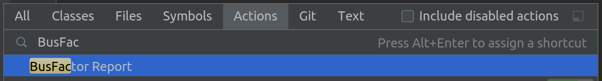
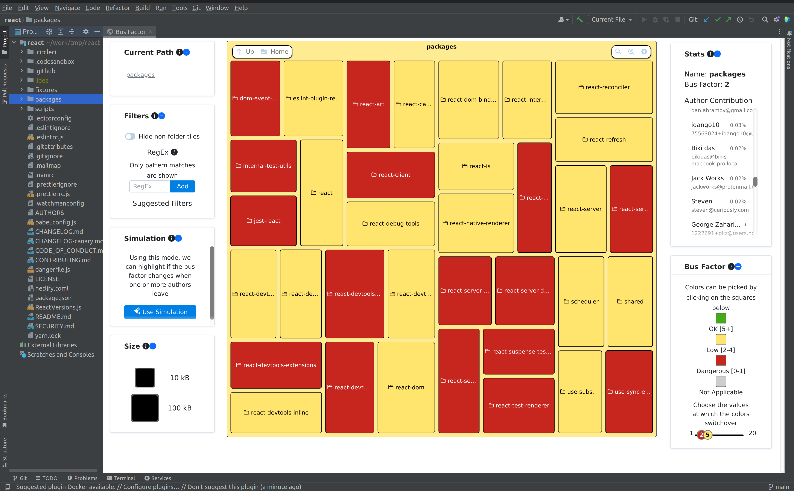
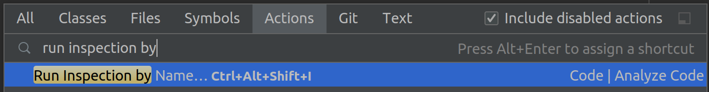
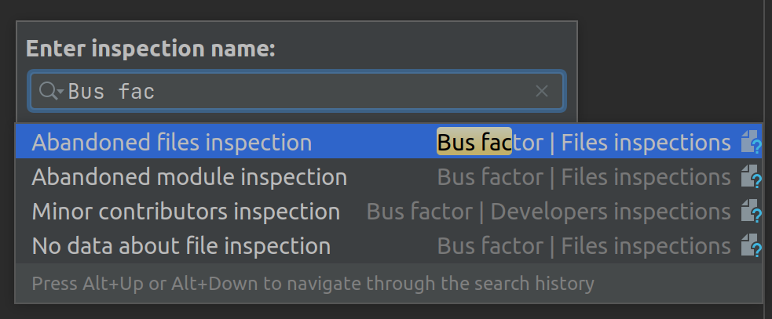

# BusFactor Plugin
<!-- Plugin description -->

An experimental plugin for bus factor analysis.

The plugin provides:

<ul>
    <li>Interactive treemap visualization of the bus factor for the project.</li>
    <li>Inspections based on the bus factor.</li>
</ul>
<!-- Plugin description end -->

## Usage

### IDEA

#### Treemap Visualization

To access the treemap visualization:

1. Open the `Search Everywhere` window by pressing ⇧⇧ (macOS) / Shift+Shift (Windows/Linux).
2. Type `BusFactor Report`.
3. Select the option.

Once the calculation is done, it will open a window with the treemap visualization.

#### Inspections

You can run inspections via `Run inspection by name...`.

* Using Search Everywhere:
  1. Open the `Search Everywhere` window.
  2. Type `Run inspection by name...`.
  3. Select the option.

* Using UI:
  <kbd>Code</kbd> > <kbd>Analyze Code</kbd> > <kbd>Run inspection by name...</kbd>

In the `Enter inspection name` window, type the name of the inspection provided by the plugin. 
Alternatively, type `Bus factor` to see available inspections.

After selecting an inspection, set the necessary parameters and run it.

#### Available Inspections

* `Minor contributors inspection` — reports that most of the contributors to the file are minor contributors.
  A minor contributor is defined as someone with less than 0.05 authorship for the file.
  The report is displayed if the partition of minor contributors is above the threshold.
  The threshold can be set in settings.
* `Abandoned files inspection` — reports abandoned files. A file is considered abandoned when its authorship is less than 1.
* `Abandoned module inspection` — reports abandoned modules.
  A module is considered abandoned if the partition of abandoned files is above the threshold.
  The threshold can be set in settings.
* `No data about file inspection` — reports abandoned files if there is no stored information about them.
  A file is considered abandoned if there is no information about it after calculations.
  There is no information about the file if it has not appeared in VCS history within a time gap.
  The default time gap is 1.5 years.

#### Settings

<kbd>File</kbd> > <kbd>Settings...</kbd> > <kbd>BusFactor plugin</kbd>

In settings, you can set the following parameters:

* `Minor Contributors Threshold` — value for triggering the `Minor contributors inspection`.
  When the partition of minor developers reaches the threshold, it triggers a warning for the file.
* `Abandonment Partition Threshold` — value for triggering the `Abandoned module inspection`.
  When a module is abandoned more than the provided threshold, it triggers a warning for the file.
* `Ignore extensions` — ignored file extensions in calculations.
* `Look for reviewers in comment of commit` — use developers mentioned in commit messages for calculating the bus factor.  
